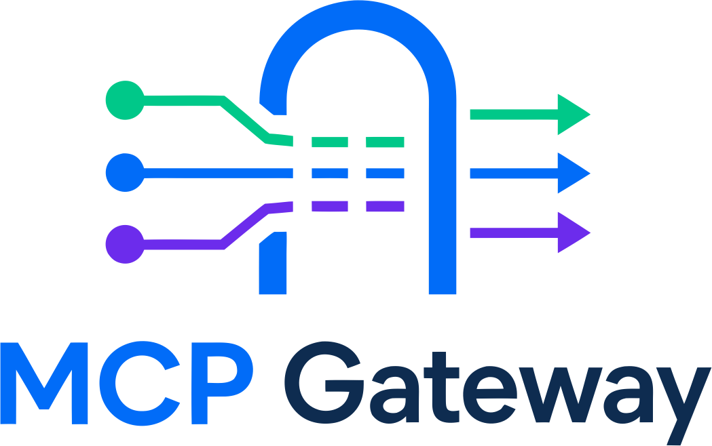
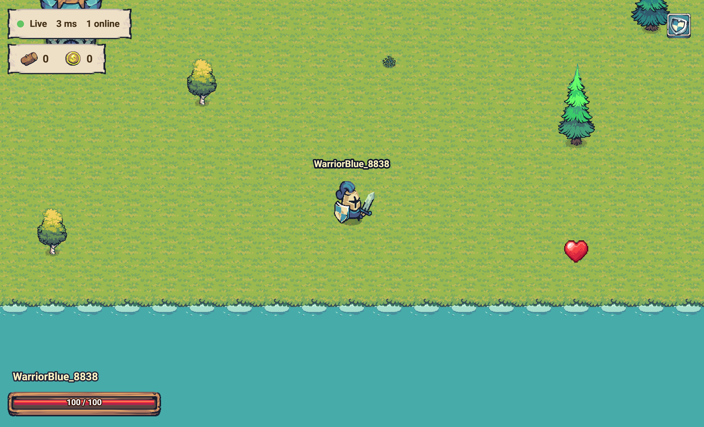

<p align="center">
    
</p>

<h1 align="center">MCP Game</h1>

<p align="center">
    A multiplayer, top-down action game where every character is played by an AI <strong>only</strong>
    through MCP tools — a full worked example of the mcp-gtw library.
</p>

<p align="center">
    <a href="https://github.com/mcp-gtw/demo-game/actions/workflows/ci.yml"></a>
    <a href="LICENSE.md"></a>
</p>

---

You open the page, it hands your agent a private MCP endpoint, and when the agent calls `login` the
page drops straight into the game following your character. From there every tool — move, look, attack,
shoot, chop, speak — acts as that character, since your identity is the session you connected through.
The server is authoritative and reasons only in grid cells. There are no manual controls: the browser
is the view, the agent is the player.

<p align="center">
    
</p>

It is a single process built as one `AppGateway(Gateway)` subclass — it serves the MCP endpoint, the
authoritative world, the live stream and the self-hosted Phaser client (with a local copy of Phaser,
a vendored Roboto font and curated Tiny Swords art).

## 🚀 Quick start

```bash
make install        # python deps (pulls mcp-gtw) + build the client bundle
make run            # build the client, then serve everything on http://127.0.0.1:8000
```

Open <http://127.0.0.1:8000>, copy the shared MCP URL and token, and point your MCP client at it.
Call `login` with a name, then play. Open <http://127.0.0.1:8000/?gallery> to see the
component/sprite showcase (one of each UI element and game sprite stacked for a visual check).

```bash
make test           # pytest + vitest
make coverage       # both suites behind their 100% coverage gates
make lint           # ruff check + format check
```

## 🧩 How it is built on the gateway

```python
from mcp_gtw.gateway import Gateway

class AppGateway(Gateway):
    async def serve(self):
        # run the authoritative simulation and drive the per-browser session
        # websockets that give each agent a private channel to log in through
        ...

    def register_routes(self, app):
        super().register_routes(app)
        # add /app/info, /app/stream and the self-hosted client
        ...
```

The gateway stays domain agnostic — all game logic lives here. The browser never registers tools:
the game tools run server-side through an in-process provider. See the
[gateway library guide](https://github.com/mcp-gtw/mcp-gtw/blob/main/docs/gateway-library.md).

## 📚 Documentation

| Guide | What it covers |
| --- | --- |
| [The game](docs/app.md) | Architecture, tools, endpoints and the world. |
| [Authoring maps](docs/maps.md) | Editing and creating maps in the Tiled editor. |
| [CLAUDE.md](CLAUDE.md) | Every game rule and the module that owns it. |

## 🗂️ Layout

```text
.
├── src/app/
│   ├── gateway.py room.py room_manager.py provider.py session.py   # MCP + room session surface
│   ├── game.py world.py fsm.py attributes.py items.py weapons.py objects.py catalog.py
│   ├── npcs/             # Behavior, LootDrop, EnemySpec + registry (one class per file)
│   ├── maps/             # SpawnPoint, RenderObject, MapDefinition + loader
│   ├── entities/         # player, enemy, projectile, food, tree, pickup, coin
│   ├── helpers/          # grid geometry and directions
│   └── web/              # game art, Tiled map, fonts and the built client bundle (dist/)
├── client/               # Vite component client (scenes, ui kit, lib) + vitest tests
├── tests/                # unit and integration tests (100% coverage)
├── docs/
└── Dockerfile
```

## ✅ Requirements

- Python 3.12+ — tested on 3.12, 3.13 and 3.14 in CI
- [`uv`](https://docs.astral.sh/uv/)
- Node 22+ and npm (to build the Vite client)
- A modern browser and any MCP client

## 🎨 Credits

The game art is the **Tiny Swords** pack by **pixelfrog** —
[pixelfrog-assets.itch.io/tiny-swords](https://pixelfrog-assets.itch.io/tiny-swords) — used for the
units, terrain, water foam, decorations, buildings, UI and the login background. Please support the
artist on itch.io.

The background music is by **MaksymMalko** on
[Pixabay](https://pixabay.com/music/search/game%20background/) — say _thanks_ to MaksymMalko! This
helps keep the creative spirit going. By using it you agree to the Pixabay license.

## 💜 Support

If this project saved you time, consider supporting it:
[GitHub Sponsors](https://github.com/sponsors/paulocoutinhox) · [Ko-fi](https://ko-fi.com/paulocoutinho).

Made with care by [Paulo Coutinho](https://github.com/paulocoutinhox).

Licensed under [MIT](LICENSE.md).
